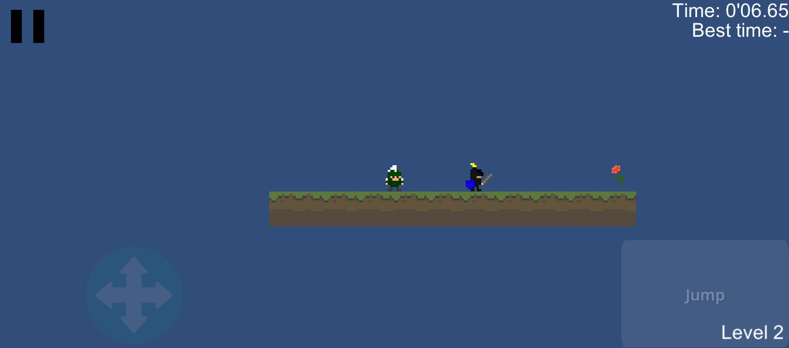

## Spartry'n'die ##

Spartry’n’die is a 2D platform game build in Unity.

It is a ‘Die and retry’ game: each level has an increasing difficulty and the goal is  
- at first to finish each level,
- at second the fastest you can,
- at third with the fewest deaths.

This git contains the ***final version*** of my game.

There are some bonus levels which ask skills or reflexion.  
Some ennemies are going to your last position on the ground.    
You can double-jump, fall from platform and stun enemy in jumping on his head.

Download links :

[Smartphone](https://github.com/nicolasventer/Spartry-n-die/raw/master/Spartry'n'die.apk)

[WebGL](https://github.com/nicolasventer/Spartry-n-die/raw/master/Spartry'n'dieWebGL.zip)

---

WebGL version controller :

You can pause/unpause the game with 'P' key or 'Start' button.  
You can exit the game at any time with 'Escape' key or 'B' button (on controller).  
The other inputs are inside the About menu.
